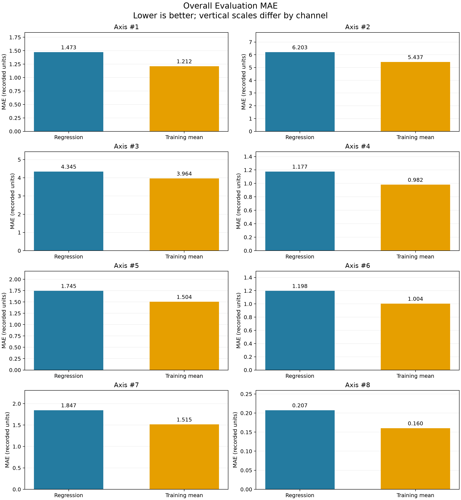
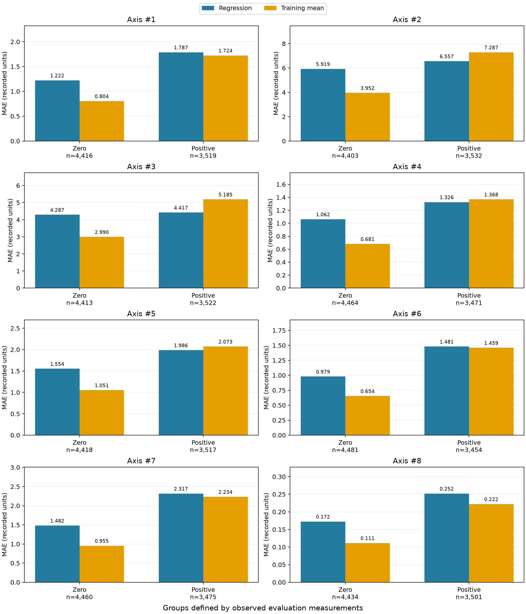

# Robot Regression Evaluation with MAE

**Author:** Antonio Sainz  
**Course:** CSCN8010  
**Instructor:** David Espinoza  
**Activity:** Individual Extra-Credit Assignment  
**Selected method:** Mean Absolute Error (MAE)

## 1. Project Objective

This project extends Practical Lab 1 by evaluating the prediction errors of eight independent univariate linear regressions. Each regression uses elapsed time to predict one recorded robot measurement channel.

The analysis asks:

1. What is the evaluation MAE for each channel?
2. Does the regression outperform a constant training-mean baseline?
3. How do errors differ between zero-valued and positive-valued observations?

This extension evaluates numerical predictions. It does not establish mechanical fault-detection accuracy.

## 2. Repository Contents

```text
robot-mae-evaluation/
├── README.md
├── requirements.txt
├── .gitignore
├── data/
│   └── RMBR4-2_export_test.csv
├── notebooks/
│   └── 01_mae_evaluation.ipynb
└── outputs/
    ├── data_quality_summary.csv
    ├── partition_summary.csv
    ├── model_parameters.csv
    ├── axis_1_error_details.csv
    ├── mae_comparison.csv
    ├── mae_by_observed_group.csv
    ├── group_error_contributions.csv
    └── figures/
        ├── 01_overall_mae_comparison.png
        └── 02_mae_by_observed_group.png
```

The submitted notebook should contain the outputs of its latest successful execution. Output files are regenerated when the notebook runs.

## 3. Data and Connection to Practical Lab 1

The included CSV is copied from the author's Practical Lab 1 project:

[Original laboratory repository](https://github.com/antoniosg2025-stack/robot-predictive-maintenance)

The recording contains 39,672 observations. This extension uses timestamps and channels `Axis #1` through `Axis #8`.

The original lab integrated PostgreSQL, regression models, residual thresholds, and sustained-deviation alerts. This extension reads the included CSV locally to make MAE evaluation reproducible without database credentials. It does not rerun the original database or alert pipeline.

Physical units and the mapping of channels to physical robot joints are not independently verified. Errors are reported in **recorded units**.

## 4. Automated Reproduction from a Fresh Environment

This workflow supports an instructor or an automated reviewer starting
without a project environment. VS Code and manual notebook interaction
are not required.

### Prerequisites

The documented command sequence uses Windows PowerShell.

Required system tools:

- Python 3.12, including pip and venv.
- Git for cloning, or an extracted ZIP of the complete repository.
- Internet access to download dependencies.
- Permission to create a virtual environment and write project outputs.

Python 3.12.7 is the version used by the author.

If Python is missing, install Python 3.12 from:
https://www.python.org/downloads/

If Git is missing, install Git from:
https://git-scm.com/downloads

Installing system software may require approval in the reviewer's
environment. If installation is blocked, report the unmet prerequisite;
do not claim that reproduction succeeded.

Check available tools:

```powershell
py -3.12 --version
git --version
```
### Obtain the complete project

Clone this repository and enter its root directory:

```powershell
git clone https://github.com/antoniosg2025-stack/robot-mae-evaluation.git
if ($LASTEXITCODE -ne 0) {
    throw "Repository cloning failed."
}

Set-Location -LiteralPath "robot-mae-evaluation"
```

All subsequent commands run from this directory, which contains
`requirements.txt`, `data/`, and `notebooks/`.

The original Practical Lab 1 repository linked in Section 3 documents
provenance only; it is not the execution target for this assignment.

### Create a fresh virtual environment

Use a fresh checkout with no existing `.venv` directory:

```powershell
py -3.12 -m venv .venv
if ($LASTEXITCODE -ne 0) {
    throw "Failed to create the Python 3.12 virtual environment."
}
```

Install the exact recorded dependency versions:

```powershell
.\.venv\Scripts\python.exe -m pip install -r requirements.txt
if ($LASTEXITCODE -ne 0) {
    throw "Dependency installation failed."
}
```

Check compatibility:

```powershell
.\.venv\Scripts\python.exe -m pip check
if ($LASTEXITCODE -ne 0) {
    throw "Dependency compatibility check failed."
}
```

Always use the virtual environment's Python executable. No activation
step is required.

## 5. Execute and Inspect Automatically

### Register the project kernel locally

Install a kernel specification inside the virtual environment.
This does not require a global or user-level kernel installation.

```powershell
.\.venv\Scripts\python.exe -m ipykernel install `
    --prefix ".venv" `
    --name "robot-mae-evaluation" `
    --display-name "Robot MAE Evaluation"

if ($LASTEXITCODE -ne 0) {
    throw "Project kernel registration failed."
}
```

Make the local kernel specification discoverable in this PowerShell session:

```powershell
$projectJupyterPath = Join-Path (Get-Location).Path ".venv\share\jupyter"

if ($env:JUPYTER_PATH) {
    $env:JUPYTER_PATH = $projectJupyterPath + [IO.Path]::PathSeparator + $env:JUPYTER_PATH
} else {
    $env:JUPYTER_PATH = $projectJupyterPath
}
```

### Execute the notebook in a fresh kernel

Create the execution-output directory:

```powershell
New-Item -ItemType Directory -Force -Path "outputs\execution" | Out-Null
```

Execute every code cell in order:

```powershell
.\.venv\Scripts\python.exe -m nbconvert `
    --to notebook `
    --execute "notebooks\01_mae_evaluation.ipynb" `
    --ExecutePreprocessor.kernel_name=robot-mae-evaluation `
    --ExecutePreprocessor.timeout=300 `
    --output "executed_mae_evaluation.ipynb" `
    --output-dir "outputs\execution"

if ($LASTEXITCODE -ne 0) {
    throw "Notebook execution failed. Inspect the reported cell error."
}
```

Execution must stop on an error. Do not enable `allow_errors`, suppress
failed assertions, or substitute old outputs for current execution evidence.

The executed notebook is saved separately:

```text
outputs/execution/executed_mae_evaluation.ipynb
```

The analysis also regenerates the CSV tables and figures listed in
Section 2. The submitted source notebook is not overwritten.

### Produce a readable execution report

After successful execution, export the executed notebook as HTML:

```powershell
.\.venv\Scripts\python.exe -m nbconvert `
    --to html "outputs\execution\executed_mae_evaluation.ipynb" `
    --output "mae_evaluation_report" `
    --output-dir "outputs\execution"

if ($LASTEXITCODE -ne 0) {
    throw "HTML report generation failed."
}
```

The report is available at:

```text
outputs/execution/mae_evaluation_report.html
```

### Review the current execution evidence

Inspect the newly executed notebook and verify:

- All nine code cells completed with no error outputs.
- The dataset contains 39,672 observations.
- Partition sizes are 23,803, 7,934, and 7,935.
- Eight regressions and eight training-mean references are evaluated.
- Direct MAE calculations match scikit-learn.
- Group-weighted MAEs reproduce overall MAEs.
- Group contributions reproduce overall method differences.
- The expected CSV tables and two figures were generated.

Expected check messages include:

```text
PASS: source data validation completed.
PASS: chronological partitions are complete and non-overlapping.
PASS: regression and mean-baseline predictions are ready.
PASS: the direct MAE calculation matches scikit-learn.
PASS: all 16 direct MAE calculations match scikit-learn.
PASS: all populated group MAEs match scikit-learn.
PASS: weighted group MAEs reproduce every overall MAE.
PASS: group contributions reproduce all overall MAE differences.
```

Use Section 8 to locate evidence for each rubric criterion.

A successful execution verifies the implemented computational checks.
It does not independently verify the author's oral understanding or
justify assigning full marks automatically.

### Optional interactive execution

For interactive inspection, open the source notebook in VS Code,
select the project's `.venv` kernel, restart the kernel, and run all cells.

### Reproduction status

Clean-environment reproduction completed successfully in a separate
GitHub checkout with a newly created virtual environment on the author's
existing Windows computer.

Dependency compatibility checks passed, all nine code cells executed
without saved errors, and HTML export completed.

See outputs/reproduction_check.json for the tested commit and results.
This test verifies a fresh project environment on the same computer,
not a different operating system or a machine without Python and Git.

## 6. Evaluation Method

The original chronological partition boundaries are retained:

| Partition | Observations | Use in this extension |
|---|---:|---|
| First 60% | 23,803 | Fit regressions and calculate training means |
| Middle 20% | 7,934 | Preserve the original calibration partition; excluded from the main evaluation |
| Final 20% | 7,935 | Evaluate predictions |

Each regression has the form:

```text
prediction = slope × elapsed seconds + intercept
```

Each baseline predicts the corresponding channel's training mean.

Both methods are evaluated on the same observations:

```text
MAE = sum(abs(observed − predicted)) / observation count
```

Direct calculations are checked against scikit-learn using numerical tolerances of `rtol=1e-12` and `atol=1e-12`. Rounding is used only for display.

Group analyses include observation counts. Count-weighted group MAEs must reconstruct overall MAE.

## 7. Main Results

The training-mean baseline achieves lower overall MAE in all eight channels for this evaluation period.

For Axis 1:

| Method | Evaluation MAE |
|---|---:|
| Linear regression | 1.4726 |
| Training-mean baseline | 1.2121 |

The group results provide additional context:

- **Zero-valued observations:** the baseline has lower MAE in all channels.
- **Positive-valued observations:** regression has lower MAE in Axes 2, 3, 4, and 5; the baseline has lower MAE in Axes 1, 6, 7, and 8.
- **Negative-valued observations:** none occur in this evaluation partition.

In Axes 2–5, improvements on positive observations are outweighed by larger errors on zero observations, accounting for group sizes.

### Overall MAE



### MAE by observed group



Vertical scales differ between channel panels. Compare methods within each channel.

## 8. Reviewer Guide and Rubric Evidence

| Criterion | Notebook location | Supporting evidence |
|---|---|---|
| Code accuracy | Sections 2–5, 7, and 9 | Partition assertions, direct/library comparisons, weighted reconstruction checks |
| Interpretation | Sections 6, 9, and 10 | Recorded units, baseline comparison, group findings, limitations |
| Clarity of walkthrough | Section 11 | Three talking points linked to relevant code sections |
| Evidence and transparency | Section 12 and opening AI disclosure | Individual self-assessment, saved outputs, figures, and this README |

The three walkthrough topics are:

1. Separating fitting from evaluation.
2. Calculating and independently verifying MAE.
3. Interpreting overall and group-specific results.

Self-assessment scores are recorded in the notebook once the individual review is completed. They do not replace the instructor's assessment.

Reviewers should verify the calculations and evidence rather than treating documentation claims as proof of correctness.

## 9. Limitations

- The evaluation partition was previously examined; this is an exploratory extension, not a new blind test.
- Results concern one recording and one evaluation period.
- Zero and positive values do not establish machine operating states.
- MAE does not measure error direction, maximum error, or event duration.
- A lower MAE does not establish better mechanical fault detection.
- The mean baseline is not the optimal constant baseline for absolute error; a training-median baseline is a possible extension.
- No statistical-significance or industrial-reliability claim is made.
- The original detector would require separate recalibration and evaluation before changing its predictor.

## 10. AI Assistance and Reproducibility Status

AI assistance supported code drafting, explanations, interpretation,
and review. The author executed the notebook and is responsible for
checking and explaining the submitted work.

Interactive execution, automated execution, and HTML export completed
successfully. Reproduction also passed in a separate GitHub checkout
with a newly created virtual environment on the author's existing
Windows computer.

The tested commit and verification results are recorded in
outputs/reproduction_check.json. That record identifies the specific
version tested.

## 11. Troubleshooting

| Issue | Action |
|---|